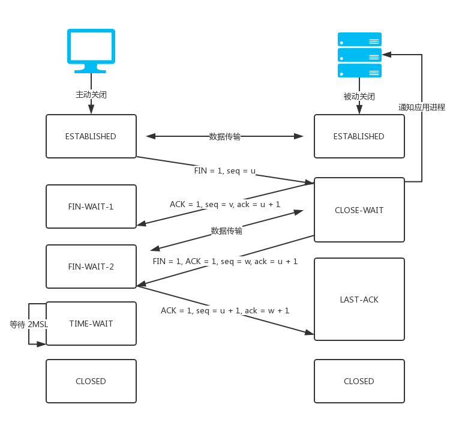

# FE-Basics

> 📒 前端基础知识。

-   [技能树](#技能树)
-   [BFC](#bfc)
-   [浏览器渲染页面过程](#浏览器渲染页面过程)
-   [TCP](#tcp)
-   [JS单线程运行机制](#JS单线程运行机制)
-   [事件](#事件)
    
    -   [事件流](#事件流)
    -   [事件委托](#事件委托)

-   [HTML](#html)

    -   [基础标签](#基础标签)

-   [CSS](#css)

    -   [CSS 样式](css-样式)
    -   [选择器](#选择器)
    -   [文本溢出](#文本溢出)
    -   [CSS3 新特性](#css3-新特性)

-   [Javascript](#javascript)

    -   [原型与原型链](#原型与原型链)
    -   [继承实现](#继承实现)
    -   [深拷贝](#深拷贝)
    -   [Ajax](#ajax)
    -   [格式化日期](#格式化日期)
    -   [new 实现]（#new-实现）
    -   [call 实现](#call-实现)
    -   [apply 实现](#apply-实现)
    -   [bind 实现](#bind-实现)
    -   [instanceof 实现](#instanceof-实现)
    -   [Promise 实现](#promise-实现)
    -   [debounce 防抖](#debounce-防抖)
    -   [throttle 节流](#throttle-节流)

-   [双向绑定](#双向绑定)

    -   [Object.defineProperty](#objectdefineproperty)
    -   [Proxy](#proxy)
    
-   [算法](#算法)

    -   [冒泡排序](#冒泡排序)
    -   [选择排序](#选择排序)
  
-   [Webpack](#webpack)
    
    -   [常用loader](#常用loader)

## 技能树


## BFC

BFC 定义: BFC(Block formatting context)直译为"块级格式化上下文"。它是一个独立的渲染区域，只有Block-level box参与， 它规定了内部的Block-level Box如何布局，并且与这个区域外部毫不相干。

BFC布局规则:

-   内部的Box会在垂直方向，一个接一个地放置。
-   Box垂直方向的距离由margin决定。属于同一个BFC的两个相邻Box的margin会发生重叠
-   每个元素的margin box的左边， 与包含块border box的左边相接触(对于从左往右的格式化，否则相反)。即使存在浮动也是如此。
-   BFC的区域不会与float box重叠。
-   BFC就是页面上的一个隔离的独立容器，容器里面的子元素不会影响到外面的元素。反之也如此。
-   计算BFC的高度时，浮动元素也参与计算

哪些元素会生成BFC:

-   根元素
-   float属性不为none
-   position为absolute或fixed
-   display为inline-block, table-cell, table-caption, flex, inline-flex
-   overflow不为visible

[参考](https://www.cnblogs.com/lhb25/p/inside-block-formatting-ontext.html)

## TCP

#### TCP三次握手


#### TCP四次挥手



## 浏览器渲染页面过程

1. 用户输入URL地址
2. 对URL地址进行DNS域名解析
3. 建立TCP连接（三次握手）
4. 浏览器发送HTTP请求报文
5. 服务器返回HTTP响应报文
6. 关闭TCP连接（四次挥手）
7. 浏览器解析文档资源并渲染页面

## JS单线程运行机制

-   消息队列：消息队列是一个先进先出的队列，它里面存放着各种消息。
-   事件循环：事件循环是指主线程重复从消息队列中取消息、执行的过程。

主线程只会做一件事情，就是从消息队列里面取消息、执行消息，再取消息、再执行。当消息队列为空时，就会等待直到消息队列变成非空。而且主线程只有在将当前的消息执行完成后，才会去取下一个消息。这种机制就叫做事件循环机制，取一个消息并执行的过程叫做一次循环。消息就是注册异步任务时添加的回调函数。

#### 事件循环

macroTask(宏任务): 主代码块, setTimeout, setInterval, setImmediate, requestAnimationFrame, I/O, UI rendering

microTask(微任务): process.nextTick, Promise, Object.observe, MutationObserver

## 事件

#### 事件流

-   事件捕获阶段
-   处于目标阶段
-   事件冒泡阶段

#### 事件委托

不在事件的发生地（直接dom）上设置监听函数，而是在其父元素上设置监听函数，通过事件冒泡，父元素可以监听到子元素上事件的触发，通过判断事件发生元素DOM的类型，来做出不同的响应。

举例：最经典的就是ul和li标签的事件监听

## HTML

#### 基础标签

```html
<head></head>

<meta />

<link rel="stylesheet" href="" />

<title></title>

<body></body>

<center></center>

<section></section>

<article></article>

<aside></aside>

<div></div>

<ul></ul>

<li></li>

<p></p>

<h1></h1>
~
<h6></h6>

<button></button>

<input type="text" />

<a href=""></a>

<span></span>

<strong></strong>

<i></i>
```

## CSS

#### CSS 样式

优先级: 行内样式 > 链接式 > 内嵌式 > @import 导入式

#### 选择器

```css
/* 选择所有元素 */
* {
}

/* 选择 div 元素 */
div {
}

/* 选择类名元素 */
.class {
}

/* 选择 id 元素 */
#id {
}

/* 选择 div 元素内的所有 p 元素 */
div p {
}

/* 选择 div 元素内下一层级的 p 元素 */
div > p {
}
```

css选择器权重: !important -> 行内样式 -> #id -> .class -> 元素和伪元素 -> * -> 继承 -> 默认

#### 文本溢出

```css
// 文本溢出单行显示
.single {
  overflow: hidden;
  text-overflow:ellipsis;
  white-space: nowrap;
}

// 文本溢出多行显示
.multiple {
  display: -webkit-box;
  -webkit-box-orient: vertical;
  -webkit-line-clamp: 3;
  overflow: hidden;
}
```

#### CSS3 新特性

-   transition：过渡
-   transform：旋转、缩放、移动或者倾斜
-   animation：动画
-   gradient：渐变
-   shadow：阴影
-   border-radius：圆角

## Javascript

#### 原型与原型链

-   实例的 __proto__ 属性（原型）等于其构造函数的 prototype 属性。
-   Object.proto === Function.prototype
-   Function.prototype.proto === Object.prototype
-   Object.prototype.proto === null

#### 继承实现

```js
function extend(child, parent) {
    var F = function() {}; // 空函数为中介，减少实例时占用的内存

    F.prototype = parent.prototype; // f继承parent原型

    child.prototype = new F(); // 实例化f，child继承，child、parent原型互不影响

    child.prototype.constructor = child; // child构造函数指会自身，保证继承统一

    child.super = parent.prototype; // 新增属性指向父类，保证子类继承完备
}
```

#### 深拷贝

```js
function deepCopy(s, t) {
    t = t || (Object.prototype.toString.call(t) === "[object Array]" ? [] : {});

    for (var i in s) {
        if (typeof s[i] === "object") {
            t[i] = deepCopy(s[i], t[i]);
        } else {
            t[i] = s[i];
        }
    }

    return t;
}
```

#### Ajax

```js
var ajax = {};

ajax.get = function(url, fn) {
    var xhr = new XMLHttpRequest();

    xhr.open("GET", url, true);

    xhr.onreadystatechange = function() {
        if (
            xhr.readyState === 4 &&
            (xhr.status === 200 || xhr.status === 403)
        ) {
            fn.call(this, xhr.responseText);
        }
    };

    xhr.send();
};

ajax.post = function(url, data, fn) {
    var xhr = new XMLHttpRequest();

    xhr.open("POST", url, true);

    xhr.setRequestHeader("Content-Type", "application/x-www-form-urlencoded");

    xhr.onreadystatechange = function() {
        if (
            xhr.readyState === 4 &&
            (xhr.status === 200 || xhr.status === 403)
        ) {
            fn.call(this, xhr.responseText);
        }
    };

    xhr.send(data);
};
```

#### 格式化日期

```js
function formatDate(date, format) {
    if (arguments.length === 0) return null;

    format = format || "{y}-{m}-{d} {h}:{i}:{s}";

    if (typeof date !== "object") {
        if ((date + "").length === 10) date = parseInt(date) * 1000;
        date = new Date(date);
    }

    const dateObj = {
        y: date.getFullYear(),
        m: date.getMonth() + 1,
        d: date.getDate(),
        h: date.getHours(),
        i: date.getMinutes(),
        s: date.getSeconds(),
        a: date.getDay()
    };

    const dayArr = ["一", "二", "三", "四", "五", "六", "日"];

    const str = format.replace(/{(y|m|d|h|i|s|a)+}/g, (match, key) => {
        let value = dateObj[key];

        if (key === "a") return dayArr[value - 1];

        if (value < 10) {
            value = "0" + value;
        }

        return value || 0;
    });

    return str;
}
```

#### new 实现

```js
function New(Class) {
    let obj = {};
    obj.__proto__ = Class.prototype;
    let res = Class.call(obj);
    return typeof res === 'object' ? res : obj;
}
```

#### call 实现

```js
Function.prototype.callfb = function (ctx) {
    if (typeof this !== 'function') {
        throw new Error('Function undefined');
    }

    ctx = ctx || window;

    const fn = ctx.fn;

    ctx.fn = this;

    const args = [...arguments].slice(1);

    const res = ctx.fn(args);

    ctx.fn = fn;

    return res;
}
```

#### apply 实现

```js
Function.prototype.applyFb = function (ctx) {
    if (typeof this !== 'function') {
        throw new Error('Function undefined');
    }

    ctx = ctx || window;

    const fn = ctx.fn;

    ctx.fn = this;

    const arg = arguments[1];

    const res = Array.isArray(arg) ? ctx.fn(...arg) : ctx.fn();

    ctx.fn = fn;

    return res;
}
```

#### bind 实现

```js
Function.prototype.bindFb = function (ctx) {

    const fn = this;

    const args = [...arguments].slice(1);

    const F = function () {};

    const fBind = function () {
        return fn.apply(this instanceof fBind ? this : ctx, args.concat(...arguments))
    }

    if (fn.prototype) {
        F.prototype = fn.prototype;
    }

    fBind.prototype = new F();

    return fBind;
}
```

#### instanceof 实现

```js
function instanceofFb(left, right) {
    let proto, prototype = right.prototype;

    proto = left.__proto__;

    while (proto) {

        if (proto === prototype) {
            return true;
        }

        proto = proto.__proto__;

    }

    return false;
}
```

#### Promise 实现

```js
function promiseFb(fn) {
    const _this = this;
    this.state = 'pending'; // 初始状态为pending
    this.value = null;
    this.resolvedCallbacks = []; // 这两个变量用于保存then中的回调，因为执行完Promise时状态可能还是pending
    this.rejectedCallbacks = []; // 此时需要吧then中的回调保存起来方便状态改变时调用

    function resolve(value) {
        if (_this.state === 'pending') {
            _this.state = 'resolved';
            _this.value = value;
            _this.resolvedCallbacks.map(cb => { cb(value) }); // 遍历数组，执行之前保存的then的回调函数
        }
    }

    function reject(value) {
        if (_this.state === 'pending') {
            _this.state = 'rejected';
            _this.value = value;
            _this.rejectedCallbacks.map(cb => { cb(value) });
        }
    }

    try {
        fn(resolve, reject);
    } catch (e) {
        reject(e);
    }
}

promiseFb.prototype.then = function (onFulfilled, onRejected) {
    // 因为then的两个参数均为可选参数，
    // 所以判断参数类型本身是否为函数，如果不是，则需要给一个默认函数如下（方便then不传参数时可以透传）
    // 类似这样： Promise.resolve(4).then().then((value) => console.log(value))
    onFulfilled = typeof onFulfilled === 'function' ? onFulfilled : fn => fn;
    onRejected = typeof onRejected === 'function' ? onRejected : e => { throw e };

    switch (this.state) {
        case 'pending':
            // 若执行then时仍为pending状态时，添加函数到对应的函数数组
            this.resolvedCallbacks.push(onFulfilled);
            this.rejectedCallbacks.push(onRejected);
            break;
        case 'resolved':
            onFulfilled(this.value);
            break;
        case 'rejected':
            onRejected(this.value);
            break;
        default: break;
    }
}
```

#### debounce 防抖

```js
function debounce(fn, wait, immediate) {
    let timer;
    return function () {
        if (immediate) {
            fn.apply(this, arguments);
        }
        if (timer) clearTimeout(timer);
        timer = setTimeout(() => {
            fn.apply(this, arguments);
        }, wait)
    }
}
```

#### throttle 节流

```js
function throttle(fn, wait) {
    let prev = new Date();
    return function () {
        const now = new Date();
        if (now - prev > wait) {
            fn.apply(this, arguments);
            prev = now;
        }
    }
}
```

## 双向绑定

**双向绑定**：视图（View）的变化能实时让数据模型（Model）发生变化，而数据的变化也能实时更新到视图层.


#### Object.defineProperty

```html
<!DOCTYPE html>
<html lang="en">
<head>
    <title>mvvm</title>
</head>
<body>
    <p>数据值：<span id="data"></span></p>
    <p><input type="text" onkeyup="keyup()"></p>
    <script>
        var obj = {
            data: ''
        }

        function keyup(e) {
            e = e || window.event;
            obj.data = e.target.value; // 更新数据值
        }

        Object.defineProperty(obj, 'data', {
            get: function () {
                return this.data;
            },
            set: function (newVal) {
                document.getElementById('data').innerText = newVal; // 更新视图值
            }
        })
    </script>
</body>
</html>
```

#### Proxy

```html
<!DOCTYPE html>
<html lang="en">
<head>
    <title>mvvm</title>
</head>
<body>
    <p>数据值：<span id="data"></span></p>
    <p><input type="text" onkeyup="keyup()"></p>
    <script>
        var obj = new Proxy({}, {
            get: function (target, key, receiver) {
                return Reflect.get(target, key, receiver);
            },
            set: function (target, key, value, receiver) {
                if (key === 'data') {
                    document.getElementById('data').innerText = value; // 更新视图值
                }
                return Reflect.set(target, key, value, receiver);
            }
        })

        function keyup(e) {
            e = e || window.event;
            obj.data = e.target.value; // 更新数据值
        }
    </script>
</body>
</html>
```

## 算法

#### 冒泡排序

两两对比

```js
function bubble(arr) {
    const len = arr.length;

    for (let i = 0; i < len; i++) {
        for (let j = 0; j < len - i - 1; j++) {
            if (arr[j] > arr[j + 1]) {
                let temp = arr[j];
                arr[j] = arr[j + 1];
                arr[j + 1] = temp;
            }
        }
    }
    return arr;
}
```

####  选择排序

寻找最小的数，将索引保存

```js
function selection(arr) {
    const len = arr.length;
    let minIndex, temp;
    for (let i = 0; i < len - 1; i++) {
        minIndex = i;
        for (let j = i + 1; j < len; j++) {
            if (arr[j] < arr[minIndex]) {
                minIndex = j;
            }
        }
        temp = arr[i];
        arr[i] = arr[minIndex];
        arr[minIndex] = temp;
    }
    return arr;
}
```

## Webpack

#### 常用loader

-   file-loader: 加载文件资源，如 字体 / 图片 等，具有移动/复制/命名等功能；
-   url-loader: 通常用于加载图片，可以将小图片直接转换为 Date Url，减少请求；
-   babel-loader: 加载 js / jsx 文件， 将 ES6 / ES7 代码转换成 ES5，抹平兼容性问题；
-   ts-loader: 加载 ts / tsx 文件，编译 TypeScript；
-   style-loader: 将 css 代码以<style>标签的形式插入到 html 中；
-   css-loader: 分析@import和url()，引用 css 文件与对应的资源；
-   postcss-loader: 用于 css 的兼容性处理，具有众多功能，例如 添加前缀，单位转换 等；
-   less-loader / sass-loader: css预处理器，在 css 中新增了许多语法，提高了开发效率；